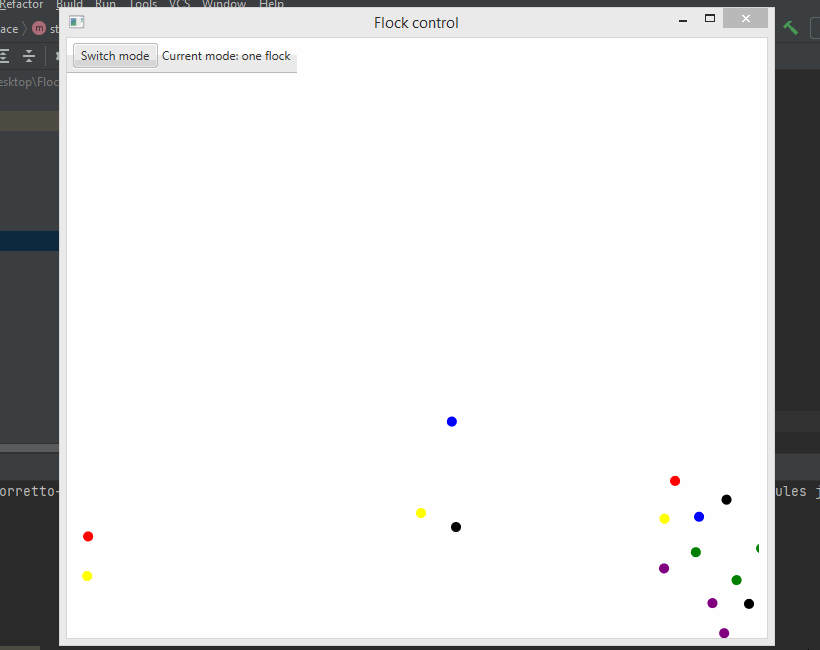

# JavaFx Flocking Simulation
### What is it?
#### Flock theory is a fairly simple concept, a "bird" of the system reacts to the other surrounding "birds" by adhering to 3 simple rules:
#### *Separation:* birds move away from other birds that are too close
#### *Alignment:* birds attempt to match the velocities of their neighbors
#### *Cohesion:* birds move toward the center of mass of their neighbors

#### But my birds aren't very realistic, They're circles:)
#### Here's gif of application:

### Here you see that, applicayion has two modes: one flock and many flocks. In one flock mode they'll join in one flock, and in many flocks vice versa.
